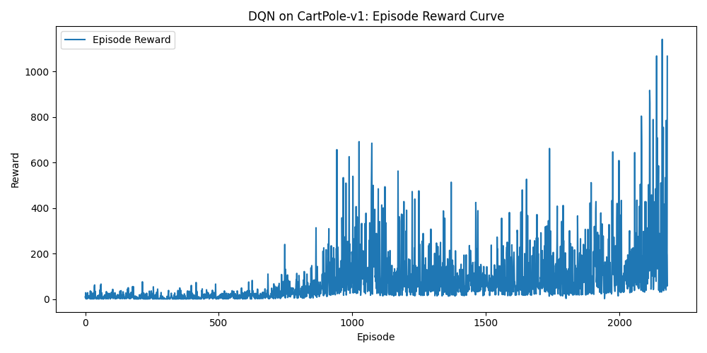
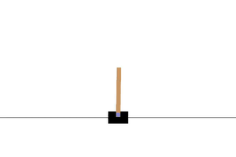

# CartPole DQN Reinforcement Learning

This project trains a DQN agent to solve the CartPole-v1 environment using Gymnasium and Stable-Baselines3.

## Features
- Modular code for training, testing, plotting rewards, and video recording
- Reward curve visualization (`reward_curve.png`)
- Video recording of the trained agent (`videos/`)

## How to Run

### 1. Train the Agent
```
python cartpole_dqn.py train
```
- Trains the agent for 100,000 timesteps
- Saves the model as `dqn_cartpole`
- Plots and saves the reward curve as `reward_curve.png`

### 2. Test the Agent
```
python cartpole_dqn.py test
```
- Loads the trained model
- Runs and visualizes the agent
- Records a video in the `videos/` folder


## Example Results
- 

### Before and After Training (Video Comparison)

| Before Training                | After Training                 |
|-------------------------------|-------------------------------|
|  |  |

> **Note:** Replace the `.gif` files above with your actual before/after video or GIF file names. If you have `.mp4` files, you can convert them to GIFs for GitHub preview, or simply provide download links:

**Download videos:**
- [Before Training (mp4)](videos/before_training.mp4)
- [After Training (mp4)](videos/after_training.mp4)

## Requirements
- Python 3.8+
- gymnasium[classic-control]
- stable-baselines3
- torch
- matplotlib

Install requirements with:
```
pip install gymnasium[classic-control] stable-baselines3 torch matplotlib
```
